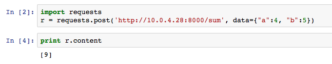
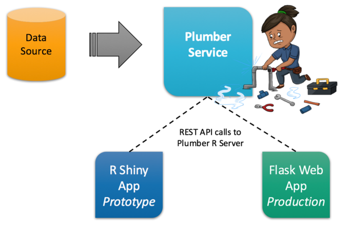
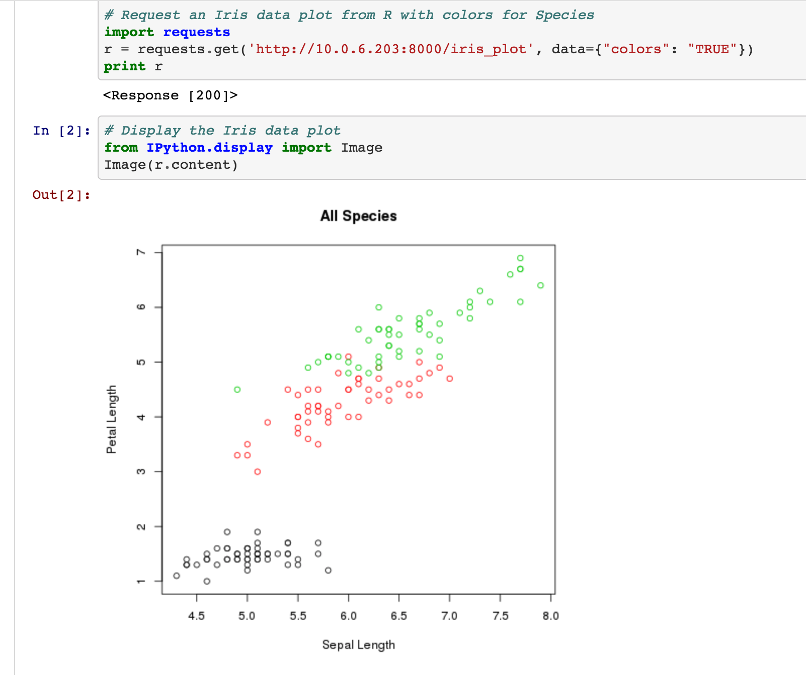

# R-Ladies DC Plumber API Workshop

### WORKSHOP DESCRIPTION

In this Workshop, we'll set up a REST API to expose code written in the R programming language. Then we'll show how to send requests to that API from data science tools and web applications in other programming languages.

This repository contains code for a simple plumber service (in R) and a simple web application (using Flask) for interacting with the API endpoints.

### PLUMBER PACKAGE DESCRIPTION

The plumber (https://www.rplumber.io/) package from Jeff Allen of RStudio and Trestle Tech makes it possible to expose R code as a REST service available to others on the web. Plumber opens an entirely new avenue for building data services and managing data products in cloud-connected environments.

#### Basic Plumber Example - R Server + Plumber Service Setup

```
# Create an R script file ex. plumber-file.R

# GET
#* @get /mean
normalMean <- function(samples=10){
  data <- rnorm(samples)
  mean(data)
}

# POST
#* @post /sum
addTwo <- function(a, b){
  as.numeric(a) + as.numeric(b)
}
```

```
# Run these commands in your R console to start a plumber service

library(plumber)
r <- plumb("plumber-file.R")

# Find the private IP of your server
r$run(host="[PRIVATE.IP.HERE]", port= 8000)
```   

Access the plumber service API endpoint from any other internet/tool interface (Ex. Jupyter Notebook):


### WORKSHOP GOAL

Use plumber endpoint services to mimic shiny application behavior in web application development for production.



The plumber package is also a great tool for cross-collaboration within a data science team using diverse toolsets.

Tools like the plumber package enable the construction of flexible systems to suit the needs of diverse data science teams. You shouldn't have to standardize on a single tool for data science work. Let your team decide what tools work best, use them all, and take advantage of the cloud for fast and simple collaboration in flexible formats.  

**Example Jupyter IPython Notebook with a `requests.get()` call:**



### WORKSHOP CODE SOLUTIONS

- Plumber R code: `plumber-script.R`
- Flask Web app: `/project`
