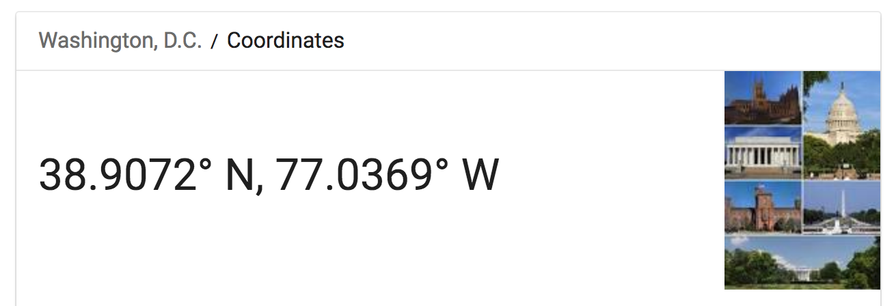

```{r setup, include=FALSE}
library(learnr)
library(leaflet)
library(dplyr)
library(htmltools)
knitr::opts_chunk$set(echo = FALSE)
```


## Topic 1

### Welcome to the Cloud!

This interactive tutorial is running in the cloud (Open Source RStudio and Shiny Server on Amazon Web Services). This is a trial run. It will only be publicly available for the duration of our workshop. All the code snippets will be shared via Github - I'll post a link on our Meetup page. 

Please let me know if you enjoy this format :)

*First! Be aware that the following packages have been installed:*

* leaflet
* dplyr
* htmltools

Installing further packages through the text input boxes is not recommended and could have unintended consequences. Feel free to install these packages on your local machine and replicate the code in RStudio on your own computer!

To install a package in your local version of RStudio use the install.packages function:

* `install.packages('leaflet')`
* `install.packages('dplyr')`
* `install.packages('htmltools')`

### First Exercise: Create a Default Leaflet Map



Create a default leaflet map centered on Washington DC:

```{r create-map, exercise=TRUE, exercise.lines = 8}
dc.longitude = # Assign longitude for DC here
dc.latitude = # Assign latitdude for DC here

m <- leaflet() %>%
  addTiles() %>%  # Nothing to do here - This function adds default OpenStreetMap map tiles
  addMarkers(lng= dc.longitude, lat= dc.latitude, popup="R-Ladies DC")

m  # Print the map
```

*Gut Check!*

* Is the map centered on a set of coordinates that are in DC?
* Does the marker pop-up message work? Click to test!

## Topic 2

### Change the Map Zoom Level and Appearance

You can change the appearance/theme design of your map by using the addProviderTiles() function and providing the name of a theme provider.

To view a list of leaflet theme providers, run the names(providers) code chunk below:

```{r view-providers, exercise=TRUE, exercise.lines = 2}
names(providers)
```

*Note that some theme providers require registering for an access token/key. I would suggest sticking with the free ones for now. Play around with requesting different themes for your DC map code, and don't worry if you get some errors for the premium themes.*

`m %>% addProviderTiles(providers$Stamen.Toner)`

```{r update-theme, exercise=TRUE, exercise.lines = 8}
dc.longitude = -77.0369
dc.latitude = 38.9072

m <- leaflet() %>%
  addProviderTiles() %>% # Put a theme in this function: providers$Stamen.Watercolor
  addMarkers(lng= dc.longitude, lat= dc.latitude, popup="R-Ladies DC")

m  # Print the map
```

### Use the setView() function for more control

*Right now, our map is being centered on a marker. But you might not always want a marker, or you might want several markers with the map centered on a non-marker central point.* 

The setView() function is a way to add additional set-up parameters on your map. You can use it to provide a centering point and a zoom level. 

Example: `setView(lng = -71.0589, lat = 42.3601, zoom = 12)`

*Select a centering point and zoom level for a map with points of interest markers for the following locations:*

* The Washington Monument
* Your Place of Work or Home
* Tysons Corner Metro Station

(You don't have to use these locations, it's just a suggestion)

```{r set-view, exercise=TRUE, exercise.lines = 12}
m <- leaflet() %>% 
  setView() %>% # Add content to the setView function
  addMarkers() # Develop a strategy for adding multiple custom markers

m # Don't forget to print!
```

```{r set-view-hint}
df <- read.csv(textConnection(
"Name,Lat,Long
Samurai Noodle,47.597131,-122.327298
Kukai Ramen,47.6154,-122.327157
Tsukushinbo,47.59987,-122.326726"
))

m <- leaflet(df) %>% 
  addTiles() %>%
  addMarkers(~Long, ~Lat, popup = ~htmlEscape(Name))
```

*Gut Check!*

* Does the map have a zoom level that contains all your markers in the frame?
* Do you have multiple markers on the map with custom popup messages? Use the hint button if you get stuck!
