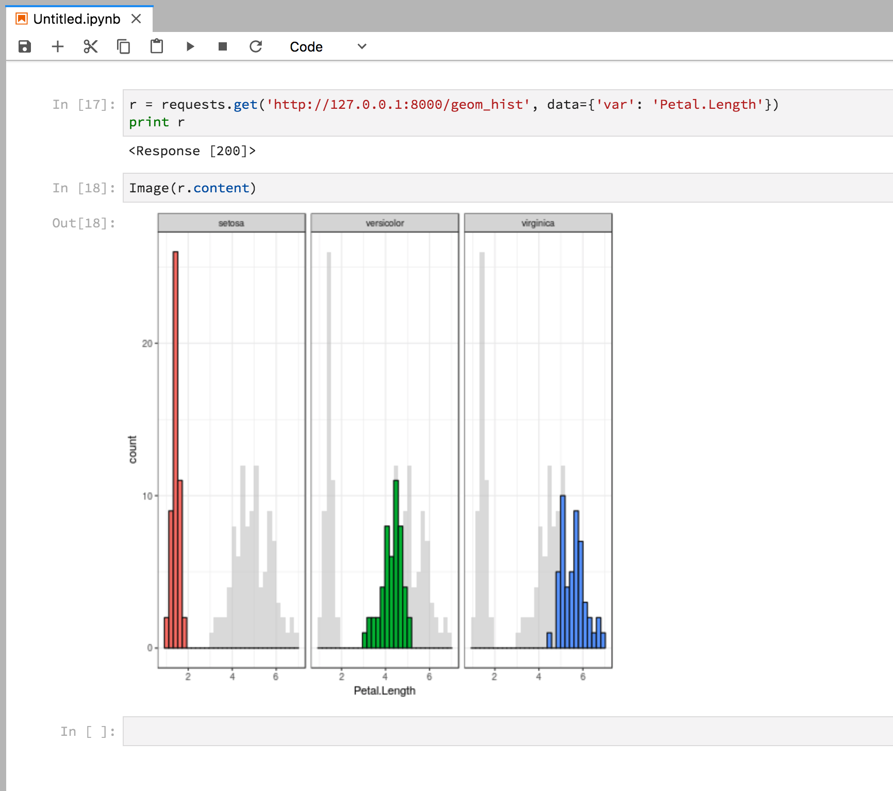

# Deploy Plumber with Docker!

[Plumber Docker Documentation](https://www.rplumber.io/docs/hosting.html#docker)

### Run Docker for Plumber Server

Run with the base trestletech docker image

```
docker run --rm -p 8000:8000 -v `pwd`/plumber.R:/plumber.R trestletech/plumber /plumber.R
```

### Create or Edit the Custom Dockerfile

Base code from plumber docs

```
FROM trestletech/plumber
MAINTAINER Docker User <docker@user.org>

RUN R -e "install.packages('ggplot2')"
# Add additional packages here...

CMD ["/app/plumber.R"]
```

### Run your custom Docker image

`docker build -f custom-docker .`

```
docker images
docker tag <image id number> great/plumber:latest
docker run --rm -p 8000:8000 -v `pwd`/plumber.R:/plumber.R great/plumber /plumber.R
```

### Use the API

Access the plumber service API endpoint from any other internet/tool interface (Ex. Jupyter Lab):

